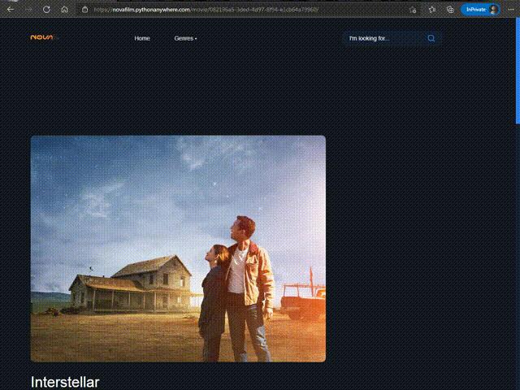

# NovaFilm
A django movie website.
My Live Demo : http://novafilm.pythonanywhere.com/

> Updated ! 
> Login, Register and Profile system added

# Plans
- [x] Login, Register and Profile system
- [x] REST APIs

# How to run?
1. git clone https://github.com/AnonC0DER/NovaFilm.git 
2. cd NovaFilm 
3. python3 manage.py createsuperuser 
**Enter your username and password** 
4. python3 manage.py runserver 
**open 127.0.0.1:8000 in your browser** 
5. Admin Panel : 127.0.0.1:8000/admin 
**Enter your username and password** 
6. Now you can post movies and series

# Files
All posters are upload [here](https://github.com/AnonC0DER/NovaFilm/tree/master/static/media/Posters)
 
Main template, navbar and pagination are [here](https://github.com/AnonC0DER/NovaFilm/tree/master/templates)
 
Settings, main urls and etc are [here](https://github.com/AnonC0DER/NovaFilm/tree/master/NovaFilm)
 
Home page, single movie page, single serial page and etc are handle [here](https://github.com/AnonC0DER/NovaFilm/tree/master/Home)
 
Css, html and js are [here](https://github.com/AnonC0DER/NovaFilm/tree/master/static)
 

----------------------------------------------

# Preview

